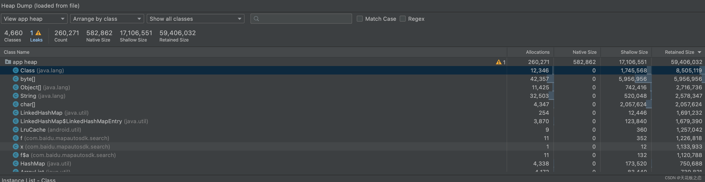

# 内存管理

## JVM(Java虚拟机)和JMM(Java内存模型)

### JMM

堆: 对象。
线程栈: 调用栈+本地变量

线程私有的：程序计数器、虚拟机栈、本地方法栈

线程共享的：堆、方法区、直接内存 (非运行时数据区的一部分)

Java 虚拟机规范对于运行时数据区域的规定是相当宽松的。  
以堆为例：堆可以是连续空间，也可以不连续。堆的大小可以固定，也可以在运行时按需扩展。    
虚拟机实现者可以使用任何垃圾回收算法管理堆，甚至完全不进行垃圾收集也是可以的。

### ① 了解内存泄露相关的知识吗？为什么会产生内存泄漏？

一个生命周期长的对象被生命周期短所持有。最终导致OOM。

- 匿名内部类
- context
- AsyncTask
- bitmap未recycle()
- 游标、IO流未及时关闭、Timer.cancel()、animator.cancel()

## ② 了解GC流程吗？

通过多个GCRoot触发查找引用树, 要是对象不在引用树上的话, 就认为是可回收的。

### ③ 有哪些对象可以作为GC Root？

1 虚拟机栈中引用的对象(栈帧中的本地变量表)
2 方法中类的静态属性引用的对象
3 方法区中常量引用的对象
4 Native方法(JNI)栈内引用的对象
5 所有被同步锁synchronized持有的对象
6 Java虚拟机内部的引用。<sub>一些常驻的异常对象(如： NullPointerException、OutOfMemoryError)，系统类加载器。</sub>

### gc触发的时机, 回收优先级(哪些对象会优先回收)

GcRetentionPolicy
每个Space都有自己的gc回收策略，如下图所示：

kGcRetentionPolicyNeverCollect：不需要回收某个Space所包含的垃圾对象（因为该Space可能不存在垃圾对象）。
kGcRetentionPolicyAlwaysCollect：每次垃圾回收都需要处理某个Space空间。
kGcRetentionPolicyFullCollect：直到最后时刻才回收某个Space空间中的垃圾对象。这个最后时刻就是所谓的full GC。

![][art_gc]

- Minor GC触发条件：当Eden区满时，触发Minor GC。

- Full GC触发条件：

（1）调用System.gc时，系统建议执行Full GC，但是不必然执行

（2）老年代空间不足

（3）方法区空间不足

（4）通过Minor GC后进入老年代的平均大小大于老年代的可用内存

（5）由Eden区、From Space区向To Space区复制时，对象大小大于To Space可用内存，则把该对象转存到老年代，且老年代的可用内存小于该对象大小

### ④ 如何检测内存泄漏？

LeakCanary

### ⑤ LeakCanary如何实现内存泄漏的检查？LeakCanary如何判断对象有没有被回收？

WeakReference 和 ReferenceQueue，即 LeakCanary 利用了 Java 的 WeakReference 和 ReferenceQueue，通过将 Activity 包装到
WeakReference 中，
被 WeakReference 包装过的 Activity 对象如果能够被回收，则说明引用可达，垃圾回收器就会将该 WeakReference 引用存放到
ReferenceQueue 中。
假如我们要监视某个 Activity 对象，LeakCanary 就会去 ReferenceQueue 找这个对象的引用，如果找到了，说明该对象是引用可达的，能被
GC 回收，
如果没有找到，说明该对象有可能发生了内存泄漏。最后，LeakCanary 会将 Java 堆转储到一个 .hprof 文件中，再使用 Shark（堆分析工具）析
.hprof 文件并定位堆转储中“滞留”的对象，
并对每个"滞留"的对象找出 GC roots 的最短强引用路径，并确定是否是泄露，如果泄漏，建立导致泄露的引用链。最后，再将分析完毕的结果以通知的形式展现出来。

原文链接：https://blog.csdn.net/hello_1995/article/details/120075342

### ② 弱引用和软引用的区别

**没有强引用指向弱引用的指向的对象时，弱引用就会被回收。**
即WeakReference不改变原有的强引用对象的垃圾回收机制。一旦其指示对象没有任何强引用对象时，此对象即进入正常的垃圾回收流程。

而软引用需要在**没有强引用指向弱引用的指向的对象**且**内存不足**时才会回收它指向的对象。

### ③ 为什么会出现内存抖动？如何处理(注意是处理不是预防)

**原因**: 短时间内申请大量临时对象, 又在短时间内释放临时对象。(比如: 循环体内;
自定义View的onDraw方法内;Adapter的getView/onBindViewHolder内申请对象)

- 定位: android profile|Tools->Android->Android Device Monitor
- LeakCanary
- ~~MAT工具(Eclipse Memory Analyzer)~~ 太过时了,应该不会再用了。
- IDEA plugin: JProfiler
- AndroidStudio: Profiler
    - Allocations：Java堆中的实例个数
    - Native Size：Native层分配的内存大小
    - Shallow Size：本对象实例在Java堆中占用的内存大小
    - Retained Size：这个类的实例本身的对象，以及它直接或者间接引用的所有对象占用的内存大小
      

- [《Android 性能优化 - 彻底解决内存抖动》](https://juejin.im/post/5a7ff867f265da4e865a6b5b)

### 内存使用最佳实践

- ① 在数据量少(1000), 增删少, 迭代多的场景可以使用SparseArray(如果key不是基础数据类型, 则用ArrayMap)。而不是HashMap。
- ② for循环比while和iterator更高效
- ③ 用基础数据类型替代枚举类型 @IntDef注解
- ④ 基础数据类型和字符串常量 应当加上static final。这样做能够充分节约内存, 避免在Java编译器的<clinit>方法中初始化。
- ⑤ 有较多字符串拼接的场景, 不要直接使用String, 而是改用StringBuilder或StringBuffer。并指定一个合理的容量。默认是16。否则扩容时会出现就对象等待回收,
  又创建一个新对象的情况。
- ⑥ 局部变量。要值不会变就放到外部, 否则每次执行这个方法都会生成一个新的还会被回收。
- ⑦ 数组/集合。如果能事先确定好大小, 可以避免多次扩容、复制等操作。
- ⑧ IO流。用完即时关闭。在finally代码块中。
- ⑨ 内存设计模式。
    - 对象池模式
        - 减少内存抖动。例: AsyncTask工作线程的执行、RecyclerView中View的重用
    - 享元模式。
        - 减少载入内存的量(节省所有对象共享的状态)。
- ⑩ Android组件泄漏(
    - Activity
    - static View
    - 非静态内部类=>WeakReference+静态内部类
    - 错误的单例实现(例: 单例对象是一个接口, 而接口实现是一个Activity)
    - 匿名内部类
    - Handler
    - Service使用结束后要关闭(stopSelf())
    - 多进程。减少重复的公共实现, 避免进程间依赖。谨慎使用能访问多个进程的组件(Service、ContentProviderx)
## 内存API
    - AndroidManifest.xml里application节点添加`android:largeHeap="true"`。但不能保证一定能申请到更大的内存。可能导致交互问题,
      影响设备的整体性能。
    - ActivityManager
        - getMemoryClass。提供给用用程序的兆字节。
        - getLargeMemoryClass。同上, 适用于`android:largeHeap="true"`
        - getMemoryInfo。系统相关的内存信息。
            - availMem: 可用系统内存。
            - lowMemory: 是否处于低内存状态。
            - threshold: 内存阈值。高于该值则处于低内存状态。
        - getMyMemoryState。当前进程(这个方法被调用的进程)的相关信息。
            - lastTrimLevel: 进程最新的内存level报告。
            - importance: 进程的优先级(系统会更具优先级杀进程)。
        - isLowRamDevice。当前设备是否是低内存设备(<=1G)。官方说法是, 这个API是用来给App开发者决定在低内存设备上是否要关闭某些需要高内存的功能。
    - System.gc()不一定会调用到Runtime.getRuntime().gc()。等下次调到System.runFinalization()
      时才会调用Runtime.getRuntime().gc()

## 主要组件内存管理

除了BroadcastReceiver外, 其他三大组件都继承ComponentCallback2, 这个接口有一个方法: onTrimMemory(level: Int)
。在系统处于低内存并要杀死进程时会调用。

| level枚举                      | level值 | 备注                                                        |
|:-----------------------------|:------:|:----------------------------------------------------------|
| TRIM_MEMORY_RUNNING_MODERATE |   5    | 应用程序可见，系统即将进人低内存状态                                        |
| TRIM_MEMORY_RUNNING_LOW      |   10   | 应用程序可见，设备的可用内存越来越少                                        |
| TRIM_MEMORY_RUNNING_CRITICAL |   15   | 应用程序可见，内存紧张，并且其他进程可能会被销毁以获得更多的可用内存                        |
| TRIM_MEMORY_UI_HIDDEN        |   20   | 应用程序不可见，该参数用于通知你，你的应用程序当前为不可见状态，你应该释放一些内存                 |
| TRIM_MEMORY_BACKGROUND       |   40   | 应用程序不可见，它在 LRU 列表中的位置在下降, 并且设备当前的运行环境内存较少                 |
| TRIM_MEMORY_MODERATE         |   60   | 应用程序不可见，它已经到达 LRU 列表的中间位置, 并且设备当前的运行环境内存较少                |
| TRIM_MEMORY_COMPLETE         |   80   | 应用程序不可见，已己经到达 LRU 列表的底部位置, 并且设备当前的运行环境内存较少。因此，应用程序可能会被杀死。 |

结论: 应用程序占用的内存越少, 就越不容易被杀死, 并且能够快速地恢复。

针对不同的内存级别, 可以针对性地对不同缓存进行清除。

Ps: Application和Fragment也实现了这个接口。

## 调试工具

### LogCat(art日志)

规则

> I/art: <GCReason> <GCName> <ObjectsFreed> (<SizeFreed›) AllocSpace Objects,
> ‹LargeObjectsFreed›(<LargeObjectSizeFreed>) <HeapStats> LOS objects, <PauseTimes>

实例

> I/art : Explicit concurrent mark sweep GC freed 125742(6MB) AllocSpace objects, 34(576KB) LOS objects, 22% free,
> 25MB/32MB, paused 1.621ms total 73.285ms

- GcReason

| GCReason               | 说明                                                                                |
|:-----------------------|:----------------------------------------------------------------------------------|
| Concurrent             | 一种并发执行的 GC事件。此类型事件执行在一个不同的线程中，所以不会迫使其他应用程序的线程挂起，包括UI线程。                           |
| Alloc                  | 当应用程序请求分配新内存，然而，已经没有足够的空间可以做这件事时，所触发的 GC事件。此时，所有的应用程序线程被阻塞，直到垃圾回收结束               |
| Explicit               | 主动强制调用System.gc()时所触发的 GC 事件。与 Dalvik一样，在 ART 中也要尽量避免这样做。                         |
| NativeAlloc            | 请求原生内存分配时所引发的 GC 事件。                                                              |
| CollectorTransition    | 在低内存设备上,转变垃圾回收器所引发的 GC事件。                                                         |
| HomogenousSpaceCompact | 当系统需要减少内存的使用，对内存碎片进行整理时，所触发的 GC 事件。                                               |
| DisableMovingGc        | 这其实并非一个真正意义上的触发 GC 的原因。而是当系统调用一个特殊的内部方法 GetPrimitiveArrayCritical时，用于提示垃圾回收事件被阻塞。 |
| HeapTrim               | 这也不是一个真正意义上的触发 GC 的原因。它用于提示在堆内存完成整理之前，垃圾回收事件被阻塞。                                  |

- GcName:ART 使用不同的垃圾回收器来释放内存，它们有着不同的行为表现,对此我们没有选择，这些信息对于分析并没有太大帮助。但不管怎样，可能会存在这些值。

| GcName                        | 说明                                                                                         |
|:------------------------------|:-------------------------------------------------------------------------------------------|
| Concurrent mark sweep (CMS)   | CMS收集器是一种以获取最短收集暂停时间为目标收集器，采用了标记-清除算法（Mark-Sweep）实现。 它是完整的堆垃圾收集器，能释放除了Image Space之外的所有的空间。 |
| Concurrent partial mark sweep | 部分完整的堆垃圾收集器，能释放除了Image Space和Zygote Spaces之外的所有空间。 [《Android内存优化（一）DVM和ART原理初探》][DVM_ART]  |
| Concurrent sticky mark sweep  | 分代收集器，它只能释放自上次GC以来分配的对象。这个垃圾收集器比一个完整的或部分完整的垃圾收集器扫描的更频繁，因为它更快并且有更短的暂停时间。                    |
| Marksweep + semispace         | 非并发的GC，复制GC用于堆转换以及齐性空间压缩（堆碎片整理）。                                                           |

O Concurrent mark sweep (CMs)
O Concurrent partial mark sweep
O Concurrent sticky mark sweep
0 Marksweep + semispace
0bjectFreed:释放的对象数量
sizeFreed:释放的对象大小。
LargeobjectFreed:从大对象空间(large space)释放的对象数量。LargeObjectSizeFreed:从大对象空间释放的对象大小。HeapStats:与
Dalvik 类似。它包含可用堆空间占总量的百分比、已分配堆的大小，以及堆的总大小。
Pauserimes:垃圾回收所暂停的时间。

- ObjectsFreed: 本次GC从非Large Object Space中回收的对象的数量。
- SizeFreed: 本次GC从非Large Object Space中回收的字节数(对象大小)。
- LargeObjectsFreed: 本次GC从Large Object Space中回收的对象的数量。
- LargeObjectSizeFreed: 本次GC从Large Object Space中回收的字节数(对象大小)。
- HeapStats: 堆的空闲内存百分比 （已用内存）/（堆的总内存）。
- PauseTimes: 垃圾回收所暂停的时间。暂停时间与在GC运行时修改的对象引用的数量成比例。目前，ART的CMS收集器仅有一次暂停，它出现GC的结尾附近。移动的垃圾收集器暂停时间会很长，会在大部分垃圾回收期间持续出现。

### ActivityManager API

#### setWatchHeapLimit(long pssSize)

> 大于等于Android6.0可用。

为堆内存设置一个观察警报。当堆的大小达到所设定的值时, 设备会dump一个hprof文件。我们可以分析这个文件, 来检查是否有内存泄漏。

ACTION: ActivityManager.ACTION_REPORT_HEAD_LIMIT

#### clearWatchHeapLimit()

清除上述监控。

### StrictMode

仅在测试环境启用, 因为它本身也后台运行也会消耗资源, 影响性能。

可以检查什么?

- 检查Activity泄漏
- 检查是否存在未被关闭的可关闭对象
- 检查当Context被销毁时, ServiceConnection或BroadcastReceiver是否存在泄漏
- 检查是否有SQLite对象在使用后, 未被关闭
- 检查每个可疑的行为

如何通知？

- 当检测到问题时, 进程会被杀死且应用程序崩溃。
- 当检测到问题时, 相关日志会被发送到DropBoxManager。DropBoxManager收集这些日志, 用于调试。
- 当检测到问题时, 日志会被记录到LogCat。

### Dumpsys

```shell
# <SERVICE>是可选的, 不指定的话就会打印所有。
adb shell dumpsys <SERVICE>
# 查看可用服务
adb shell service list
# 查看该服务可以添加哪些参数 
adb shell service <SERVICE> -h
```

#### Meminfo

```shell
# 设备内存使用情况
adb shell dumpsys meminfo
# 具体进程的内存使用情况(PID为进程id)
adb shell dumpsys meminfo <PID>
```

#### ProcStats

用于分析与应用程序相关的所有进程, 追踪后台和前台进程、它们的内存使用情况, 以及运行时间。

```shell
# 查看整个系统的整体统计信息(最近3小时)
adb shekk dumpsys procatats -hour 3
# 网易云音乐在过去三小时的整体统计信息
adb shekk dumpsys procatats com.netease.cloudmusic -hour 3
```

| 术语      | 说明                                        |
|:--------|:------------------------------------------|
| PSS     | Linux Proportional Set Size。应用程序占用的内存总大小。 |
| USS     | Linux Unit Set Size。私有内存。                 |
| percent | 过去三小时内，进程执行的时间百分比                         |
| minPss  | 最小总内存                                     |
| avgPss  | 平均总内存                                     |
| maxPss  | 最大总内存                                     |
| minUss  | 最小私有内存                                    |
| avgUss  | 平均私有内存                                    |
| maxUss  | 最大私有内存                                    |
| Norm    | 正常状态                                      |
| Mod     | 适度状态                                      |
| Low     | 低内存状态                                     |
| Crit    | 危急状态                                      |


# 总结
Android垃圾回收如何工作？
导致内存泄漏的主要原因？
什么是内存抖动？
针对内存方面的写代码最佳实践+2个设计模式
主要组件的泄漏问题(Activity、Service等)
内存相关API
读懂内存日志+内存分析工具+修复

[art_gc]: ./art/art_gc.png

[android_gc]: https://juejin.cn/post/6966205309782065159

[深入理解Android ART虚拟机]: https://weread.qq.com/web/reader/3ee32e60717f5af83ee7b37ke3732b703119e3796ae8bea

[DVM_ART]: https://liuwangshu.cn/application/performance/ram-1-dvm-art.html