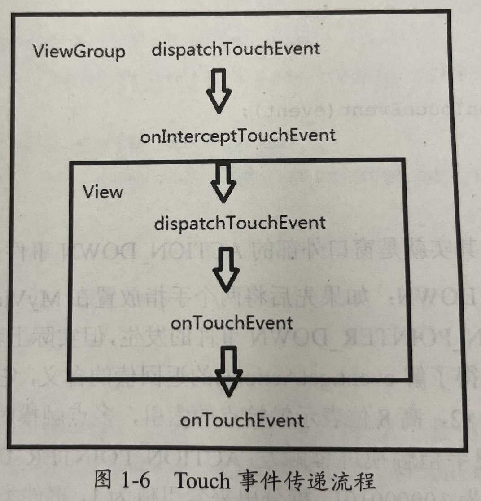

# Android

[TOC]

- [RecyclerView](recyclerview.md)
- [开源框架](open_source.md)
- [储存](storage.md)

# Android基础

## Android架构分为几层？(C/S架构)

6层。(自上而下)

- 应用框架层
- 进程通信层
- 系统服务层
- Android运行时层(Davlik/ART)
- 硬件抽象层
- Linux内核层

## 从手机桌面点击App到第一个Activity启动，发生了什么？

①点击桌面App图标，**Launcher**进程采用Binder IPC向**system_server**进程发起startActivity请求；

②system_server进程接收到请求后，向**zygote进程**发送创建进程的请求；

③Zygote进程**fork出新的子进程**，即App进程；

④**App进程**，通过Binder IPC向sytem_server进程发起**attachApplication请求**；

⑤system_server进程在收到请求后，进行一系列准备工作后，再通过binder IPC向App进程发送**scheduleLaunchActivity请求**；

⑥App进程的binder线程（ApplicationThread）在收到请求后，通过handler向主线程发送**LAUNCH_ACTIVITY消息**；

⑦主线程在收到Message后，通过反射机制创建目标Activity，并回调Activity.onCreate()等方法。

⑧到此，App便正式启动，开始进入Activity生命周期，执行完onCreate/onStart/onResume方法，UI渲染结束后便可以看到App的主界面。

###  Window、WindowManger、WindowMangerService。

Window是承载可见视图的容器。唯一实现是PhoneWindow。

WindowManager用于管理Windnow。它的实现是WindowManagerImp。具体实现是WindowManagerGlobal(代理类)。

WindowMangerService是一个系统进程。

```java
getSystemService(Context.WINDOW_ SERVICE);// 获取Window实例
```

管理窗口

### 15 ViewPager的三个Adapter要怎么选择使用?

PagerAdapter：当所要展示的视图比较简单时适用
FragmentPagerAdapter：当所要展示的视图是Fragment，并且数量比较少时适用
FragmentStatePagerAdapter：当所要展示的视图是Fragment，并且数量比较多时适用

## 多线程/并发/锁

### Android有哪些创建多线程的方式

IntentService、HandlerThread、AsyncTask

### IntentService是怎么关闭自己创建的线程的

stopSelf()

### Handler/Looper/MessageQueue关系

一个Looper->1个MessageQueue->多个Handler

Handler发送消息, 进入MessageQueue, Looper取消息交给对应的Handler处理。

一个Looper可以有多个Handler吗？YES
一个Handler可以发消息给另一个Handler处理吗？不能
Handler可以绑定多个Looper吗？不能

### 如何终止一个HandlerThread？

`mHandlerThread.getLooper().quit();`
向此looper的MessageQueue发送一个target为null的message，就可以停止这个线程的运行。

## View绘制与分发

### ① View的事件分发过程

触摸事件的分发自上而下分别是Activity->Window->View。顶级View一般是一个ViewGroup,
若事件一直未被处理则ViewGroup会下发给其下层的View直到下层View无Child为止;最底层的View也不处理事件的话，事件则会向上传递，直到传递到处理事件的View;若所有的View都不处理事件，那么事件最后会交由Activity处理。

- public boolean dispatchTouchEvent(MotionEvent ev)

  用来进行事件的分发。返回值表示是否消费当前事件。

- public boolean onInterceptTouchEvent(MotionEvent ev)

  是否拦截当前事件。

- public boolean onTouchEvent(MotionEvent ev)

  是否消费当前事件。(若不消费，在同一个事件序列中，当前View无法再次接收到事件)

以上三个方法的关系可以用以下伪代码来描述：

```java
public boolean dispatchTouchEvent(MotionEvent ev) {
    boolean consume = false;
    if (onInterceptTouchEvent(ev)) {
        consume = onToucheEvent(ev);
    } else {
        consume = child.dispatchTouchEvent(ev);
    }
    return consume;
}
```



### onTouch、onTouchEvent和onClick的关系

当一个View需要处理事件时，且该View设置了OnTouchListener，那么onTouch被调用，若onTouch的返回值为false，则onTouchEvent会被调用;
返回true，则onTouchEvent不会被调用。即onTouch的优先级高于onTouchEvent。

在onTouchEvent中，如果View设置了OnClickListener，则会调用OnClick。故，OnClick事件的优先级低于onTouchEvent。

*注: 若希望深入了解View的触摸事件分发，建议阅读任玉刚的《Android开发艺术探索》的第3章3.4节。*

### 了解ACTION_CANCEL事件吗

**触发条件**

上层 View 回收事件处理权的时候，子View 才会收到一个 ACTION_CANCEL 事件。

举个例子:

> 上层 View 是一个 RecyclerView，它收到了一个 `ACTION_DOWN` 事件，由于这个可能是点击事件，所以它先传递给对应 ItemView，询问
> ItemView 是否需要这个事件，然而接下来又传递过来了一个 `ACTION_MOVE`事件，且移动的方向和 RecyclerView 的可滑动方向一致，所以
> RecyclerView 判断这个事件是滚动事件，于是要收回事件处理权，这时候对应的 ItemView 会收到一个 `ACTION_CANCEL`
> ，并且不会再收到后续事件。

### 简述绘制流程。垂直同步了解吗？16ms刷新了解吗

measure -> layout -> draw

VSync技术通过一个定期同步信号，同步显卡与显示器，从而避免了“Tearing”（撕裂）现象。

VSync一般依赖于缓冲技术，否则：在系统的FPS低于显示器刷新频率的情况下，仍然会有“Tearing”（撕裂）现象，这个不难理解；在系统的FPS高于显示器刷新频率的情况下，显卡会将一部分时间浪费在等待上，因为没有可用的内存用于绘制。

当界面不需要刷新时（用户无操作，界面无动画），app 就接收不到屏幕刷新信号所以也就不会让 CPU 再去绘制视图树计算画面数据工作，但是底层仍然会每隔
16.6 ms 切换下一帧的画面，只是这个下一帧画面一直是相同的内容。

HWComposer每16ms发出的信号, 经由WindowManger->ViewRootImpl->最后触发页面上所有View的draw流程(仅当页面发生变化的情况;
否则不重绘)

当 next() 方法在取 Message 时发现队头是一个同步屏障的消息时，就会去遍历整个队列，只寻找设置了异步标志的消息，如果有找到异步消息，那么就取出这个异步消息来执行，否则就让
next() 方法陷入阻塞状态。如果 next()
方法陷入阻塞状态，那么主线程此时就是处于空闲状态的，也就是没在干任何事。所以，如果队头是一个同步屏障的消息的话，那么在它后面的所有同步消息就都被拦截住了，直到这个同步屏障消息被移除出队列，否则主线程就一直不会去处理同步屏幕后面的同步消息。

##### textView.setText()调用两次，触发几次垂直刷新？最后显示第一次还是第二次的数据？

一次。

第二次。

### requestLayout()/invalidate()区别

requestLayout: 向上调用指导顶层View。会走layout和measure流程。可能会走draw流程。

invalidate: draw。

### 开启/关闭硬件加速对View绘制有何影响

开启: 将一部分绘制计算工作交给GPU处理(原来是CPU做的)。提搞渲染效率。

有些绘制Api不支持开启硬件加速。即相同的绘制Api在开启/关闭硬件加速的展示效果不同。

### 如何用Drawable优雅地实现自定义View的动画效果

自定义Drawable。重写相应的方法。

### RenderThread了解吗？

> RenderThread 是一个由系统管理的线程，它可以在UI线程阻塞时保持动画平滑。

在 UI 线程外执行优化操作与将绘制操作分发给 GPU。

这种间接的方式可以带来诸多好处：

一个展示列表可以被多次绘制，而不需要重新执行业务逻辑。

特定的操作（如转换、放缩等等）可以覆盖整个列表，无需重新安排某个绘制操作。

一旦所有的绘制操作已知，就可以进行优化：比如，如果可能，所有的文字都一起绘制。

展示列表的处理工作可能可以分发给另一个线程执行。

### 16 如何针对机型做自定义View的优化

合理使用warp_content，match_parent.
尽可能的是使用RelativeLayout
针对不同的机型，使用不同的布局文件放在对应的目录下，android会自动匹配。
尽量使用点9图片。
使用与密度无关的像素单位dp，sp
引入android的百分比布局。
切图的时候切大分辨率的图，应用到布局当中。在小分辨率的手机上也会有很好的显示效果。

### 有没有遇到过页面卡顿？是什么原因造成的？最佳实践？如何排查发生的原因？

Android Profile定位。

**假设发现卡顿是因为LayoutInflate加载布局文件引起的, 如何优化？**

1 使用ViewStub延迟加载
2 使用约束布局/merge+include等方式减少View层级(能使用相同效果的布局优先使用LinearLayout和Fragment而不是RelativeLayout)
3 `new View()`的形式代替布局文件(省去加载布局文件的IO任务消耗)

**对于`new View()`的方式, 写起来比较繁琐，还有进一步优化的余地吗？**

可以用编译时注解, 针对布局文件自动生成对应的Java代码。解放重复劳动。

## 跨进程通信

#### ①  Binder原理

内存映射简单的讲就是将用户空间的一块内存区域映射到内核空间。映射关系建立后，用户对这块内存区域的修改可以直接反应到内核空间；反之内核空间对这段区域的修改也能直接反应到用户空间。

#### ② Messager

Messenger是基于Message对象进行跨进程通信的，类似于Handler发送消息实现线程间通信一样的用法。

### 8 JSBridge的原理

定义了一套WebView/JS和Native的通信规则

### 9 打包流程

#### ① 简述一下打包流程

- 混淆在哪一步
- R文件生成在哪一步,了解它的内容结构吗
- apk里的resuource.arsc有什么用

具体说来：

1. 通过AAPT工具进行资源文件（包括AndroidManifest.xml、布局文件、各种xml资源等）的打包，生成R.java文件。
2. 通过AIDL工具处理AIDL文件，生成相应的Java文件。
3. 通过Javac工具编译项目源码，生成Class文件。
4. 通过DX工具将所有的Class文件转换成DEX文件，该过程主要完成Java字节码转换成Dalvik字节码，压缩常量池以及清除冗余信息等工作。
5. 通过ApkBuilder工具将资源文件、DEX文件打包生成APK文件。
6. 利用KeyStore对生成的APK文件进行签名。
7. 如果是正式版的APK，还会利用ZipAlign工具进行对齐处理，对齐的过程就是将APK文件中所有的资源文件举例文件的起始距离都偏移4字节的整数倍，这样通过内存映射访问APK文件
   的速度会更快。

#### ② 如何快速优雅地打渠道包(applicationId一致, 仅资源文件不同, 答flavors的不得分)

参看美团的walle方案。

### 10 Android安全

1 数据加密传输
2 https
3 代码混淆(proguard)
4 暴露的组件(四大组件)
android:exported=“false”
android:protectionLevel="signature"
5 使用WebView注意js注入
setJavaScriptEnabled(true)

### 14 如何做内存优化

#### ① 内存泄漏方面

- 错误的单例实现
- 内部类持有外部类的强引用
- 资源打开未关闭(Bitmap, IO流)

#### ② 内存抖动方面

- onDraw申请对象

- 循环体申请对象

- RecyclerView/ListView#Adapter申请对象

#### ③ 其他

- 加载大图避免OOM

- 动态广播注册与注销

- 使用SpareArray代替Map\<Integer, Object>(key不需要自动装箱;数据量小的情况下，随机访问效率更高)

- SharedPreferences性能优化:

    - 不要存放大key和大value。会引起界面卡，频繁GC，占用内存等。
    - 无关的配置项不要放在一起。文件大了读取效率也会降低(SP本质上是xml文件)

- 节制的使用Service，当启动一个Service时，系统总是倾向于保留这个Service依赖的进程，这样会造成系统资源的浪费，可以使用IntentService，执行完成任务后会自动停止。

- 当界面不可见时释放内存，可以重写Activity的onTrimMemory()方法，然后监听TRIM_MEMORY_UI_HIDDEN这个级别，这个级别说明用户离开了页面，可以考虑释放内存和资源。

- 避免在Bitmap浪费过多的内存，使用压缩过的图片，也可以使用Fresco等库来优化对Bitmap显示的管理。

- 使用优化过的数据集合SparseArray代替HashMap，HashMap为每个键值都提供一个对象入口，使用SparseArray可以免去基本对象类型转换为引用数据类想的时间。

#### ④ 排查

- Android Profiler

- LeakCanary

## MotionLayout用过吗