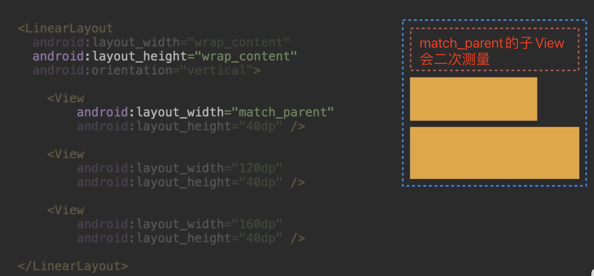

# Jetpack Compose

声明式UI(类似Flutter)。
- DataBinding
- Swift UI
- Flutter

大写字母开头的函数。用组合代替继承。

个人观点: 编程语言的发展。越来越接近于自然语言。而将自然语言转化成机器能识别的指令的这部分工作, 都交给了语言底层或者编译器去实现。

## 什么叫声明式？

让开发者来描述页面, 而不是操作页面组件。

以下这些功能实现都不需要操作页面组件就可以完成: 
- 自定义绘制
- 自定义布局
- 自定义触摸操作
- 自定义各种监听

## 为什么Compose只能用Kotlin来写不能用用Java来写？
因为Compose用了大量的otlin特性, 而这些特性不能用Java简单实现。 比如Kotlin的属性委托(properties delegation)。

## DataBinding也是一种声明式UI。和Compose有什么区别？

二者本质上都是通过界面对数据进行订阅来实现对界面的更新。
最大区别: DataBinding只能改变界面元素的值。但Compose可以改变界面中的任何元素, 包括页面元素和页面结构。

## ViewGroup重复测量

重复测量是ViewGroup实现正确测量的必须手段。

onMeasure用来测量子View
onLayout用来摆放测量好的字View

为什么会重复测量？

比如一个纵向LinearLayout宽度设置wrap_content时, 会依次测量它的子View, 把最宽的子View作为自己的宽度。

## Compose不允许重复测量？是怎么做到正确测量？

Compose引入了一个概念: Intrinsic Measurement(固有特性测量) // 感觉翻译成「固有尺寸测量」更好理解。

Compose允许父组件在对子组件进行正式测量之前, 先测量一下这个子组件的「固有尺寸」。（白话: 子组件内部内容的最大、最小尺寸是多少）

O(2n) => O(2n)

引申出一个结论: 在Compose里疯狂嵌套写页面和把所有组件写在同一层里的性能是完全一样的。

## Compose在哪些方面超越了原生View, 哪些没有？
超越: 多组件共同参与的动画
未超越: 滑动列表场景Compose比不过RecyclerView(20210506, 20221031)

SurfaceView和TextureView(用于高速刷新内容, 视频播放、相机取景器界面等)。Compose是没有对应组件的。还是需要老老实实地原生SurfaceView和TextureView。
原因是这俩不完全算View体系内的, 而是跟Android的Surface相关的显示系统。无论用不用Compose, 这俩东西都是需要单独学的。

## 状态转移型动画 
animateFloatAsState()
animateDpAsState()
animateColorAsState()

## Compose可以使用View的属性动画吗？为什么？

不能。因为属性动画是通过修改View的属性来完成动画效果的。Compose里拿不到View对象(或者说框架设计者就不希望开发者拿到View对象), 所以属性动画的整套理论体系就不适用了。

### 硬要把属性动画拿到Compose来用能做到吗？

技术上能做到。但没必要, 也不应该这样做。

## Compose最大的风险是什么？

官方弃坑。官方开发了几年后发现Compose里的坑太大了, 怎么都填不平, 最终弃坑, 砍掉了Compose项目。然后大家都回到View体系。
扔物线朱凯认为Compose已经迈过这个坎了, 现在还剩下一些靠时间慢慢打磨可以解决的小问题了。官方的态度: 要让Compose替代View称为新的UI方案。