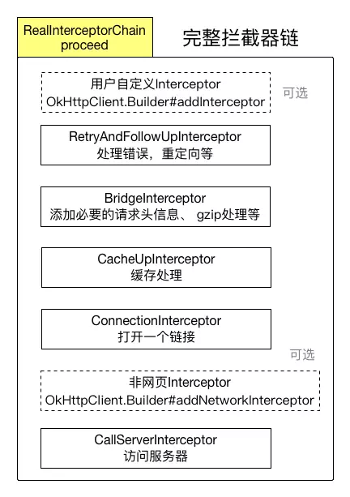
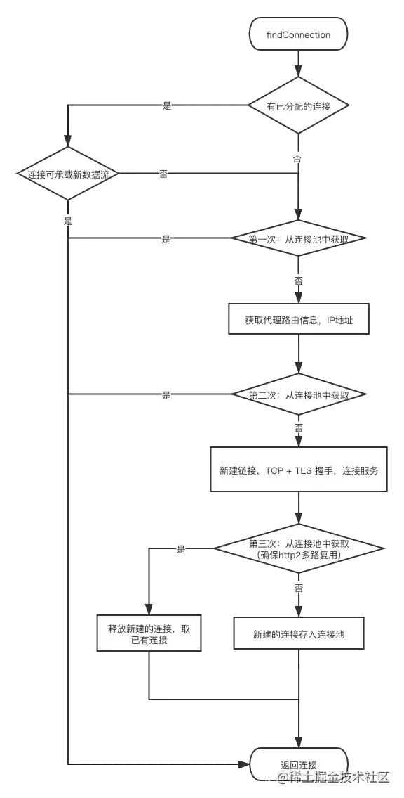

# 网络

## Retrofit

- 类型安全的HTTP客户端, Java/Android都可以使用。
- 通过注解实现RESTful网络接口, 底层使用Okhttp完成网络请求的实现。
- 封装了主线程和子线程的切换以及网络数据的解析(不同的covert)。
- 动态代理实现。

## Okhttp

- HTTP/2下, 如果网络请求host是同一个, 则允许这些请求共用一个socket
- 使用连接池减少数据流量
- 透明的gzip压缩, 减少数据流量
- 缓存网络响应, 避免重复网络请求
- 网络错误恢复、重试。

### OKHttp 请求的整体流程是怎样的?

- 1 通过建造者模式构建 OKHttpClient 与 Request
- 2 OKHttpClient 通过 newCall 发起一个新的请求
- 3 通过分发器维护请求队列与线程池，完成请求调配
- 4 通过五大默认拦截器完成请求重试，缓存处理，建立连接等一系列操作
- 5 得到网络请求结果

### OKHttp 分发器是怎样工作的?

分发器的主要作用是维护请求队列与线程池。

请求数最大不超过64,同一Host请求不能超过5个

### OKHttp 拦截器是如何工作的?

开始: getResponseWithInterceptorChain(): Response 方法
结束: CallServerInterceptor的intercept -> 返回Response

责任链模式

| 拦截器	                         | 作用                                                                                                                                 |
|:-----------------------------|:-----------------------------------------------------------------------------------------------------------------------------------|
| 应用拦截器	                       | 拿到的是原始请求，可以添加一些自定义 header、通用参数、参数加密、网关接入等等。                                                                                        |
| RetryAndFollowUpInterceptor	 | 处理错误重试和重定向                                                                                                                         |
| BridgeInterceptor	           | 应用层和网络层的桥接拦截器，主要工作是为请求添加cookie、添加固定的header，比如Host、Content-Length、Content-Type、User-Agent等等，然后保存响应结果的cookie，如果响应使用gzip压缩过，则还需要进行解压。 |
| CacheInterceptor	            | 缓存拦截器，如果命中缓存则不会发起网络请求。                                                                                                             |
| ConnectInterceptor	          | 连接拦截器，内部会维护一个连接池，负责连接复用、创建连接（三次握手等等）、释放连接以及创建连接上的socket流。                                                                          |
| networkInterceptors（网络拦截器）   | 	用户自定义拦截器，通常用于监控网络层的数据传输。                                                                                                          |
| CallServerInterceptor        | 	请求拦截器，在前置准备工作完成后，真正发起了网络请求。                                                                                                       |

作用: 监控、重写、重试。

应用拦截器(addIntercept)+网络拦截器(addNetworkIntercept)

- 自定义应用拦截器

- RetryAndFollowUpInterceptor: 处理错误恢复和重定向

- BridgeInterceptor: 添加必要的请求头信息、gzip处理

- CacheInterceptor: 缓存查找和保存

- ConnectionInterceptor: 无缓存的情况下, 建立连接

- 自定义网络拦截器

- CallServerInterceptor: 发出请求

### 应用拦截器和网络拦截器有什么区别?

1. 发生错误重试或重定向应用拦截器会调用多次, 而网络拦截器只会调用一次。如果命中缓存(CacheInterceptor), 则可能不会调用。

2. 应用拦截器可以多次调用 proceed 方法（本地异常重试）或者不调用 proceed 方法（中断），但是网络拦截器, 可且仅可调用一次
   proceed 方法。

3. 应用拦截器，通常用于统计客户端的网络请求发起情况；网络拦截器，可用于统计网络链路上传输的数据。

### OKHttp 如何复用 TCP 连接?

ConnectionInterceptor使用了5种方法查找连接：

1 首先会尝试使用 已给请求分配的连接。（已分配连接的情况例如重定向时的再次请求，说明上次已经有了连接）
2 若没有已分配的可用连接，就尝试从连接池中 匹配获取。因为此时没有路由信息，所以匹配条件：address 一致——
host、port、代理等一致，且匹配的连接可以接受新的请求。
3 若从连接池没有获取到，则传入 routes 再次尝试获取，这主要是针对 Http2.0 的一个操作, Http2.0 可以复用 square.com 与
square.ca 的连接
4 若第二次也没有获取到，就创建 RealConnection 实例，进行 TCP + TLS 握手，与服务端建立连接。
5 此时为了确保 Http2.0 连接的多路复用性，会第三次从连接池匹配。因为新建立的连接的握手过程是非线程安全的，所以此时可能连接池新存入了相同的连接。
6 第三次若匹配到，就使用已有连接，释放刚刚新建的连接；若未匹配到，则把新连接存入连接池并返回。

### OKHttp 空闲连接如何清除?

1. 在将连接加入连接池时就会启动定时任务

2. 有空闲连接的话，如果最长的空闲时间大于5分钟 或 空闲数 大于5，就移除关闭这个最长空闲连接；如果 空闲数 不大于5 且
   最长的空闲时间不大于5分钟，就返回到5分钟的剩余时间，然后等待这个时间再来清理。

3. 没有空闲连接就等5分钟后再尝试清理。

4. 没有连接不清理。

### OKHttp 有哪些优点?

- 使用简单，在设计时使用了外观模式，将整个系统的复杂性给隐藏起来，将子系统接口通过一个客户端 OkHttpClient 统一暴露出来。
- 扩展性强，可以通过自定义应用拦截器与网络拦截器，完成用户各种自定义的需求
- 功能强大，支持 Spdy、Http1.X、Http2、以及 WebSocket 等多种协议
- 通过连接池复用底层 TCP(Socket)，减少请求延时
- 无缝的支持 GZIP 减少数据流量
- 支持数据缓存, 减少重复的网络请求
- 支持请求失败自动重试主机的其他 ip，自动重定向

### OKHttp 框架中用到了哪些设计模式?

- 构建者模式：OkHttpClient 与 Request 的构建都用到了构建者模式
- 外观模式：OkHttp使用了外观模式,将整个系统的复杂性给隐藏起来，将子系统接口通过一个客户端 OkHttpClient 统一暴露出来
- 责任链模式: OKHttp 的核心就是责任链模式，通过5个默认拦截器构成的责任链完成请求的配置
- 享元模式: 享元模式的核心即池中复用, OKHttp 复用 TCP 连接时用到了连接池，同时在异步请求中也用到了线程池

