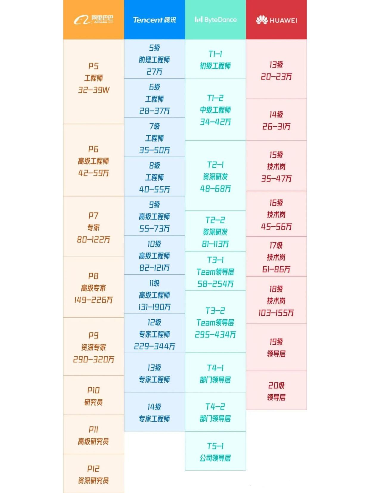

# 与面试官/HR的问答

## 1 问面试官的问题

### 客户端团队规模?职责划分？

一只手数的过来的可以不考虑了 但也不排除可能是大牛精英团队。
根据业务线分多个业务组 或 基础中台组+多个业务组。再根据技术栈分组？还是业务线里Android、iOS、前端都有。

### 招聘的岗位所属的业务线？如果后面面试顺利会加入的话, 需要加强哪方面的技能？

加强技能这块部分, 刚毕业或毕业头几年的同学可以问一下。老油条应该有明确自己的方向。

### 问一下面试官对自己的评价或建议

面试官一般不会主动提出评价和建议。因为不是每个应聘者都愿意听。一些太直接的评价甚至会激怒应聘者("你也不怎么样，凭什么说我; 我都还没打算入职你们公司, 你有什么资格对我做出批评")。

所以问这个问题最好稍稍引导一下面试官来说出一些客观的评价。比如，先夸一下对方，说面试的问题很有深度，有些我确实答得不好。无论应聘成功与否，我都希望这是一次有反馈、有价值的面试。经过这次面试，希望你能给现阶段的我一些建议和评价。可以是技术方向上的，也可以技术深度上的等等。这样比较好地引导对方来思考和回答这个问题。

这个问题最好是技术终面的时候问(一般是技术老大, 或者你入职后的直属领导)，无论技术水平还是思想境界都比你高一个高度的。问出来的建议和评价绝对是对现阶段的你最有帮助的。

### 问一下对方公司App的技术体系

语言: Java/Kotlin。用到的开源框架(网络的、图片加载的、MVC/MVP/MVVM的等)

跨平台: H5、ReactNative、flutter等, 各自占比。

如果打算入职的话, 要考虑需要加强哪方面的技能。

### 问一下对方公司的基建情况

crash、启动、内存、电量、打包/发布流程、监控、日志回捞等。

### 委婉地让面试官自我介绍一下, 说不定以后是你的同事或领导。

比如问他现在负责什么业务, 带人情况等。

### 目前招聘的这个岗位更看重候选人的什么能力, 期望的水平？
大头兵、技术攻坚、技术leader等;
直接用大厂职级去对标。比如阿里p5/p6/p7。腾讯9、10、11级。字节1-2、2-1、2-2、3-1等

## 2 问HR的问题

### 贵公司的盈利情况和融资情况

要是一直烧钱还没找到盈利点的话, 考虑一下加入后被裁的风险再决定是否加入。

### 问一下对方公司现阶段的产品规划的重心。针对重心开展的哪些业务要加大投入的。

比如我之前面过的一家公司。产品重心: **流量**+**营收**。对应的业务: **流量**对应**社交**; **营收**对应**直播业务**。那么从这里我可以得出一个结论: 直播业务是该公司未来的主要营收业务。如果你入职前可以自行挑选业务线的话，自然考虑多金的直播业务啦。

### 为什么有当前应聘岗位？

**上一任升职**:  好事。这个岗位风水好。

**上一任离职**:  得看什么原因离职。要是是留了一堆烂摊子的话 那就要慎重考虑是否加入了。

**公司业务拓展缺人**:  再具体问问, 新业务的具体细节, 执行进度。计划什么时候上线。如果时间很赶, 那就要准备好加入后加班的心理准备。

## 3 回答HR的问题

### 谈薪资

对于应聘者来说, 工资肯定是越高越好。没有人会嫌自己工资太高了。

一般来说(对于绝大多数体制健全, 面试流程规范的公司)，能到HR面，就意味着你前面的技术面是合格的，而且基本不会轻易挂你。但不代表不会挂你。

HR面没通过的情况，主要的原因有两点:

1 **薪资要太高**。超出了前面技术综合评价(评级)所属的薪资范围。大概率是超出太多了，hr觉得没得谈才拒绝你的。
毕竟用人单位招人的成本也挺大的，不会轻易在最后一关还淘汰候选人。

2 **性格缺陷**。比如不善沟通，交流口齿不清。对待工作态度不够积极。性格与企业文化相差太大。全程吐槽前公司等。尽量表现出对加入对方公司的憧憬和积极。
不要说前公司的坏话。尽量不要冷场。对于HR说的问题，尽可能自己拓展开去多说一些相关的内容。最好提前了解一下对方公司的企业规划，和现阶段的战略规划。
(这些信息可以在前面的技术面面试官那获得。比方说: 问技术面试官目前自己应聘的岗位的那一条业务线上的？公司对这条业务线的战略定位是什么样的？)

### 如何看待加班？

如果很想加入这家公司，可以从自身角度出发说说自己对加班的看法。可以这样说: 我之前没有加入像xxx(对方公司名)这样规模的公司, 如果加入xxx(对方公司名)的话，
对于我来说肯定有很多知识体系，技术架构方面的东西需要学习熟悉。为了尽快融入新的团队，我肯定会努力学习，加班也不在乎。况且现在我还年轻, 可以有足够的体力和精力加班。
加班什么的完全不在话下。

### 未来3-5年的职业规划

技术体系的成长。深度和广度两个方面讲。也可以说在技术到达一定水平之后，转技术管理岗位或者技术专家岗等等。

工作5年以上的同学一定要想好自己的专精领域。

### 入职时间

一般大公司的Offer会走一个审批流程。哪怕你真的想在入职下一家公司前歇一段时间。也最好说想尽快拿到Offer letter。这样可以拒绝掉手里的其他offer
(哪怕手里没有offer也这样说)，也可以尽快在当前单位提离职。然后再聊具体的入职时间。这个具体的入职时间就要看情况了。要是对方的岗位需要尽快入职的话，
那也只好放弃休息的时间了;否则的话，就说当前公司的离职流程可能会稍微久一些(说个1~2周没问题)。

